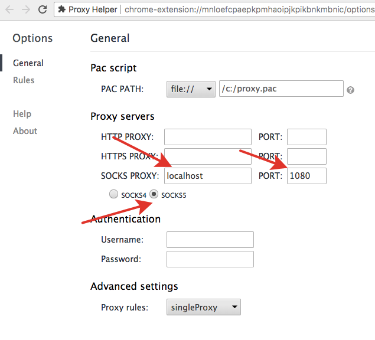
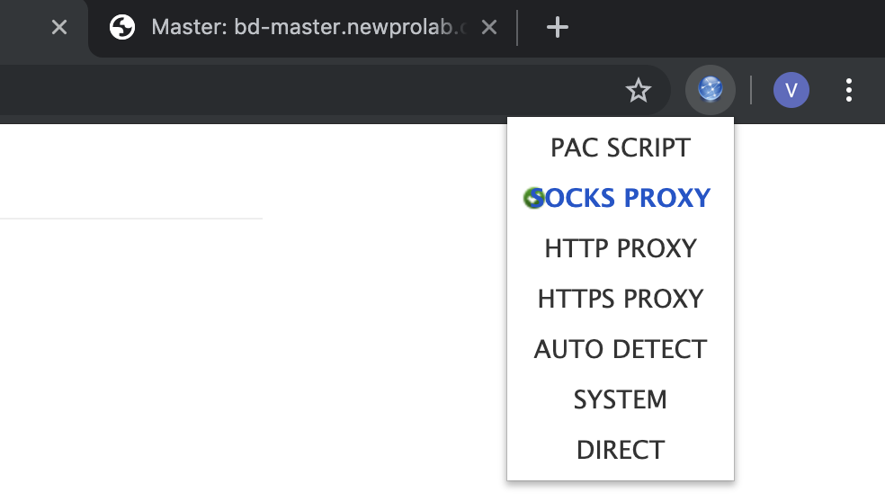
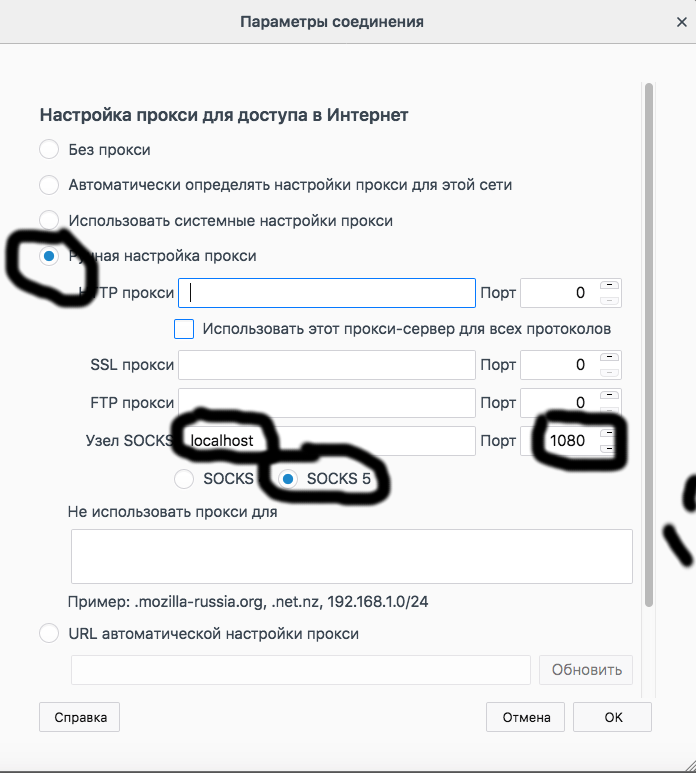
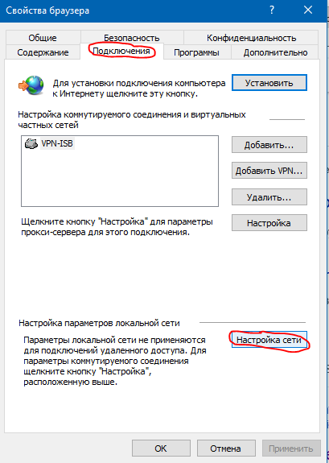
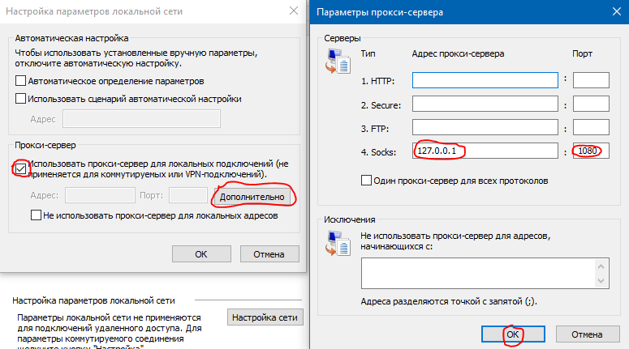

# Прокси

## Intro

Для доступа к некоторым веб-сервисам кластера был установлен простой SOCKS5 прокси сервер.

Прокси работает с браузерами только через туннель.

Итак, как это выглядит в целом. Сначала вы создаете `ssh` туннель на машину, на которой запущен прокси сервер. Затем вы конфигурируете прокси-соединение в вашем браузере.

Таким образом, каждый раз, когда вы захотите воспользоваться прокси соединением, вам придется создать туннель. Это не очень удобно, так как, например, если ваш лаптоп заснет, то туннель придется поднимать заново. Еще мы рекомендуем использовать отдельный браузер с настройками прокси, а в вашем основном браузере использовать "обычный" интернет от локального провайдера.


## Как настроить туннель

### Linux/MacOs

Добавьте следующую секцию в конец файла `~/.ssh/config`:

```
Host nplp
HostName bd-node1.newprolab.com
Port 22
User name.surname
DynamicForward 1080
IdentityFile ~/.ssh/newprolab.pem

Host *
ServerAliveInterval 30
LogLevel INFO
UserKnownHostsFile ~/.ssh/known_hosts
```

Тогда вы сможете запустить тунель как: 
```
ssh -N nplp
```

Или, если не добавлять ничего в конфиг, то можно подключиться одной командой:
```
ssh -i ~/.ssh/newprolab.pem name.surname@bd-node1.newprolab.com -D localhost:1080 -N
```

Если всё успешно, то терминал будет как-будто "висеть" и показывать пустой промпт.

### Windows

Если работаете из **CMD (Command Prompt)**, наберите команду:

```
ssh -i <PATH_TO_KEY> name.surname@bd-node1.newprolab.com -D localhost:1080 -N
```

Если всё успешно, то терминал будет как-будто "висеть" и показывать пустой промпт.

Если работаете из **gitbash**.

Добавьте в конец файла `~/.ssh/config`:

```
Host nplp
HostName bd-node1.newprolab.com
Port 22
User name.surname
DynamicForward 1080
IdentityFile ~/.ssh/newprolab.pem
ServerAliveInterval 30
```

Тогда вы сможете запустить тунель как: 
```
ssh -N nplp
```

Или подключайтесь одной командой:
```
ssh -i ~/.ssh/newprolab.pem name.surname@bd-node1.newprolab.com -D localhost:1080 -N
```

Если всё успешно, то терминал будет как-будто "висеть" и показывать пустой промпт.

### Настройка браузера

Так как неразумно использовать прокси для всего вашего трафика все время, то можно взять для этого дела неиспользуемый браузер и выделить его для "туннельного" доступа. Например, если пользуетесь Firefox в качестве основного браузера, то можно сконфигурировать Chrome для работы с прокси.

### Установка в хроме

Хром на Линукс и MAC OS не поддерживает настройку прокси через стандартные Settings, поэтому два пути ниже. А под Windows настройка прокси системная, смотрите описание настройки Internet Explorer. (Таким образом, вы не можете использовать Chrome и Internet Explorer для разных целей - они либо вместе без прокси, либо вместе с прокси).

### Хром – вариант 1

Установить в аддон [Proxy Helper](https://chrome.google.com/webstore/detail/proxy-helper/mnloefcpaepkpmhaoipjkpikbnkmbnic), настроить прокси используя socks5, как в картинке ниже:





### Хром – вариант 2

```
chromium-browser --proxy-server=socks5://localhost:1080
```

### Установка в Firefox

Preferences -> General -> Network Proxy -> Settings ...



### Internet Explorer

Настройки Браузера -> Соединения





### Проверка proxy

Зайдите на сайт [ifconfig.io](https://ifconfig.io) и проверьте, что ваш адрес начинается с `85.*`
